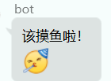

# RemindMoYuPlugin

定时在群内发送消息，以提醒群员摸鱼（提肛、喝水、上厕所等）。

通过设定时间、设定群聊、设定语料，bot会每隔24h，在设定的时间，向所有设定的群组，从所有语料中随机选择一句发送。

yml数据存在

`mirai-console/data/org.gaylong9.RemindMoYuPlugin/RemindMoYuPluginData.yml`。

## Usage

下载[`RemindMoYuPlugin.jar`](https://github.com/gaylong9/SimpleMiraiPlugins/releases/tag/jar)放在`mirai-console/plugins`下，启动mcl。

指令 `/RemindMoYuPlugin <operation> <content>`：（指令中字母全小写同样可以，如`/remindmoyuplugin showcontent`）

* `/RemindMoYuPlugin start` 启动插件（默认启动，会加载所有定时任务）
* `/RemindMoYuPlugin stop` 关闭插件（会卸载所有定时任务）
* `/RemindMoYuPlugin showGroup` 显示当前会在哪些群聊生效
* `/RemindMoYuPlugin addGroup <groupId>` 添加群号，如`/RemindMoYuPlugin addGroup 123456` 
* `/RemindMoYuPlugin removeGroup <groupId> ` 删除群号
* `/RemindMoYuPlugin containGroup <groupId> ` 检查指定群号是否被设置过
* `/RemindMoYuPlugin showContent` 查看当前语料库
* `/RemindMoYuPlugin addContent <提醒消息内容>` 
	* QQ表情：`[face:QQ表情编号]`或`[face:QQ表情中文名]`，如`[face:320]` `[face:庆祝]`，表示表情——庆祝 [Mirai中Face编号与名字查看](https://github.com/mamoe/mirai/blob/dev/mirai-core-api/src/commonMain/kotlin/message/data/Face.kt)
	* 换行：输入`\\n`
	* eg：`该摸鱼啦！\\n[face:庆祝]` 
	* 
* `/RemindMoYuPlugin removeContent <idx>`  showContent时会显示每条语料的下标，此处用下标删除对应语料（删除0号语料后，后续语料自动向前补）
* `/RemindMoYuPlugin showTime` 查看当前设置的提醒时间
* `/RemindMoYuPlugin addTime <time>` 添加提醒时间，格式必须为`HH:mm`，24小时制，小时00\~23，分钟00\~59
* `/RemindMoYuPlugin removeTime <idx>` 删除指定下标对应的时间，该时间对应的提醒任务会被卸载
* `/RemindMoYuPlugin showtask` 显示任务

